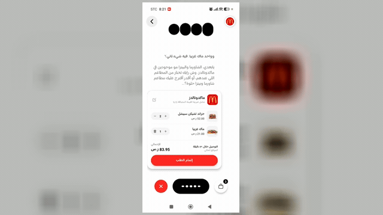

<div align="center">

# Jahez AI

**Order food by talking. In Arabic.**

A voice-first ordering experience for the Saudi market: tap the mic, speak in natural
Saudi dialect, and a real-time AI agent picks the restaurant, builds your cart, and
places the order — hands-free, end to end.

[](https://expo.dev)
[](https://reactnative.dev)
[](https://www.typescriptlang.org)
[](https://supabase.com)
[](./LICENSE)

</div>

---

## Demo

<div align="center">

<a href="https://github.com/UsoguiH/Jahez-AI-/blob/jahez-3.1-test/docs/demo.mp4">
  
</a>

<em>Speak an order in Arabic → watch the cart build itself → confirm.<br/>
▶ <a href="https://github.com/UsoguiH/Jahez-AI-/blob/jahez-3.1-test/docs/demo.mp4">Full video (with sound)</a></em>

</div>

---

## What it is

Browsing a food-delivery app is a lot of tapping: search, scroll, filter, read menus,
customize, repeat. Jahez AI replaces that with a conversation.

The user says *"أبي برجر من ماكدونالدز"* ("I want a burger from McDonald's"). The app
streams their voice to a real-time model that understands intent, talks back in a Saudi
accent, and drives the UI through structured tool calls — suggesting restaurants,
loading a menu, adding and modifying items, and confirming the order. Pricing, VAT,
quantity steppers, and the animated cart all update live as the conversation happens.

It is built to sit on top of an existing delivery catalog (the project is framed around
[Jahez](https://www.jahez.net)'s network). The differentiated part — real-time Arabic
conversation wired to a tool-driven UI — is fully working. The commercial plumbing
(payments, auth, live catalog, dispatch) is deliberately stubbed at clean seams.

## Highlights

- **Native speech-to-speech, sub-second.** Audio streams both directions continuously,
  so the model starts replying before it has finished "thinking."
- **Tool-driven UI.** The model doesn't return text for the app to parse — it calls
  typed functions (`suggest_restaurants`, `select_restaurant`, `update_cart`,
  `confirm_order`, plus a combo-customizer flow) that mutate React state directly.
- **Saudi-dialect first.** The system prompt, glossary, and TTS voice target colloquial
  Najdi Arabic ("أبشر", "تمم", "على راسي"), not formal MSA. The whole UI is RTL.
- **Menu-aware and price-safe.** Spoken items are fuzzy-matched against the real menu
  (Levenshtein + Arabic normalization), so the model can't invent dishes or prices.
- **Designed to feel alive.** Pulsing connect orb, listening waveform, staggered card
  entrances, and a spring-and-sparkle order confirmation — all on the native driver.

## How it works

```
┌──────────────────────────────────────────────┐
│        Mobile app  (Expo / React Native)      │
│   HomeScreen · VoiceOverlay · Cart · Combos   │
└───────────────┬───────────────────┬───────────┘
                │ WebSocket (audio)  │ HTTPS
                ▼                    ▼
   ┌──────────────────────┐  ┌──────────────────────────┐
   │   Voice model         │  │  Supabase (Edge / PG)    │
   │   Gemini Live          │  │  • token proxies          │
   │   speech ↔ speech       │  │  • menu fetch + search    │
   │  + OpenAI gpt-4o        │  │  • order persistence      │
   │    transcribe (captions)│  └──────────────────────────┘
   └──────────────────────┘               │
                                          ▼
                            ( catalog · payments · dispatch
                              integrate here )
```

The voice layer runs two sockets in parallel: **Gemini Live** for the spoken
conversation and tool calls, and a dedicated **OpenAI `gpt-4o-transcribe`** socket for
high-accuracy Saudi-dialect captions. The provider sits behind a single
`VOICE_PROVIDER` switch (`mobile_app/src/lib/voiceProtocol.ts`) that can roll the whole
app back to OpenAI Realtime without touching UI code.

A typical turn:

1. User taps the mic → the app fetches a short-lived token from a Supabase edge function
   (the real API key never reaches the device) and opens the socket.
2. User speaks → the model calls `suggest_restaurants`, the UI animates in restaurant
   cards, the user taps or names one, and the full menu is injected into context.
3. User builds the order naturally ("وزيد بطاطس كبير", "بدون مخلل") → each turn fires
   `update_cart` with the validated cart; the inline and full-screen carts animate.
4. User says "أكد" → `confirm_order` runs, the success animation plays, and the order is
   written to Postgres.

For the long-form version, see [`walkthrough.md`](./walkthrough.md).

## Tech stack

| Layer | Stack |
|---|---|
| **Mobile** | Expo SDK 54 · React Native 0.81 · React 19 · TypeScript · NativeWind · Reanimated |
| **Voice** | Google Gemini Live (speech-to-speech) · OpenAI `gpt-4o-transcribe` (captions) |
| **Backend** | Supabase — Postgres + Auth + Deno Edge Functions |
| **Search** | OpenAI embeddings + pgvector (`match_menu_items`) for semantic menu lookup |

## Repository layout

```
jahez-AI/
├── mobile_app/              Expo app — the product
│   └── src/
│       ├── components/      VoiceOverlay, cart widgets, restaurant cards, combo flow
│       ├── screens/         HomeScreen, OrderSummary
│       ├── lib/             voice protocol, cart validation, Supabase client, image maps
│       ├── data/            combo definitions
│       └── state/           combo store
├── supabase/functions/      Deno edge functions (token proxies, menu, orders, search)
├── tools/
│   └── menu-image-scraper/  Node tool that pulls real menu photos and bundles them
├── web_kiosk/               Vite + React — early scaffold for an in-store/admin surface
└── walkthrough.md           Deep dive into the architecture and flow
```

## Getting started

**Prerequisites:** Node 20+, the Expo tooling, and (for the backend) the Supabase CLI.

```bash
# 1. Mobile app
cd mobile_app
npm install
npx expo start            # press a / i, or scan the QR with a dev build

# 2. Edge functions (optional — a hosted Supabase project also works)
cd ../supabase
supabase functions serve
```

Configure the mobile app via `mobile_app/.env`:

```bash
EXPO_PUBLIC_SUPABASE_URL=...
EXPO_PUBLIC_SUPABASE_ANON_KEY=...
```

Server-side secrets (`OPENAI_API_KEY`, `GEMINI_API_KEY`) live on the Supabase project, so
model keys never ship in the app bundle.

### Menu image scraper

`tools/menu-image-scraper` collects real product photos for menu items and bundles them
into the app (the catalog ships without imagery). It reads a restaurant's menu, matches
each dish to the app's items by Arabic name, downloads the image, and writes a reviewable
report. See its [README](./tools/menu-image-scraper/README.md).

## Status & roadmap

**Working today**

- Real-time Arabic voice ordering with tool-driven UI
- Restaurant suggestion → menu injection → natural-language cart building
- Combo customization by voice, animated inline + full-screen carts, VAT (15%) breakdown
- Order confirmation UI + Postgres persistence, realtime order/cart subscriptions

**Stubbed at clean seams (ready to integrate)**

- Authentication (anonymous today → phone/OTP or SSO)
- Payments (no gateway wired)
- Live catalog & menus (a curated set is seeded for the demo)
- Order dispatch, delivery tracking, saved addresses, push notifications

## Disclaimer

This is an independent prototype. It is **not** affiliated with, endorsed by, or sponsored
by Jahez, HungerStation, or any restaurant brand referenced in the project. Restaurant
names, logos, and product images are the property of their respective owners and are used
here only to demonstrate the experience. Replace them with licensed or first-party assets
before any production or commercial use.

## License

Released under the [MIT License](./LICENSE). The license covers the source code in this
repository — not the third-party trademarks, logos, or imagery described above.
